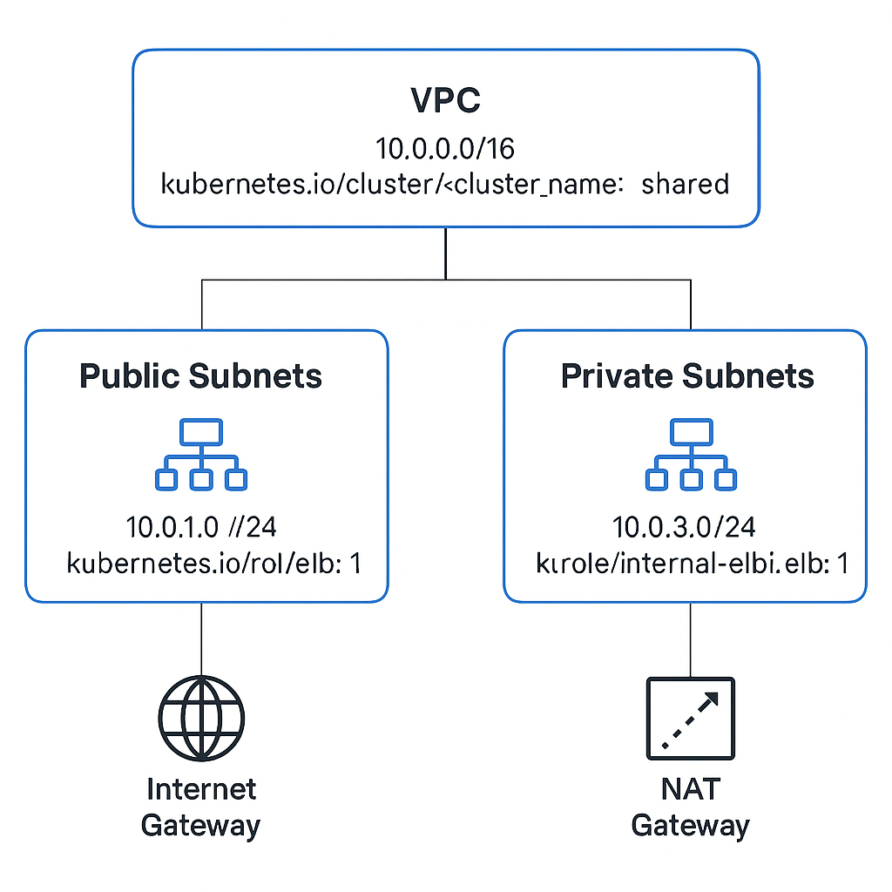

# 🚀 Terraform EKS Deployment Guide

This guide walks you through deploying an **Amazon EKS cluster with a VPC** using Terraform with modular structure.

---

## 📁 Project Structure

```
.
├── main.tf
├── variables.tf
├── modules/
│   ├── vpc/
│   │   └── main.tf
│   └── eks/
│       └── main.tf
├── backend/
│   └── main.tf (for S3 + DynamoDB remote state)
├── A_diagram_of_an_AWS_Virtual_Private_Cloud_(VPC)_ne.png
└── README.md
```

---

## 📦 Prerequisites

- AWS CLI configured (`aws configure`)
- Terraform v1.3+ installed
- IAM user with permissions for EKS, VPC, IAM, S3, and DynamoDB

---

## 🔧 Step-by-Step Deployment

### ✅ Step 1: Setup Backend (Optional but Recommended)

If not already created, go to the `backend/` folder and apply to set up S3 and DynamoDB:

```bash
cd backend/
terraform init
terraform apply
```

---

### ✅ Step 2: Initialize Terraform Project

Go to your main project folder and initialize Terraform:

```bash
cd ..
terraform init
```

---

### ✅ Step 3: Review Plan

Verify what Terraform will create:

```bash
terraform plan
```

---

### ✅ Step 4: Apply Infrastructure

Provision the VPC, EKS cluster, and node groups:

```bash
terraform apply
```

When prompted, type `yes`.

---

### 📤 Optional: Destroy Resources

To delete everything created:

```bash
terraform destroy
```

---

## 📌 Notes

- Remote state is stored in `s3://chandrasekkhar-eks-tfstate-20250713`
- State locking is handled by DynamoDB table: `terraform-eks-state-locks`
- You can update `variables.tf` to customize your cluster (name, version, node types)

---

## 🖼️ Architecture Diagram



---

## 🙋 Maintainer

**Chandrasekkhar** – reach out for any issues or improvements!

---

## 📜 main.tf


```hcl
terraform {
  required_providers {
    aws = {
      source  = "hashicorp/aws"
      version = "~> 5.0"
    }
  }

  backend "s3" {
    bucket         = "chandrasekkhar-eks-tfstate-20250713"
    key            = "terraform.tfstate"
    region         = "us-west-2"
    dynamodb_table = "terraform-eks-state-locks"
    encrypt        = true
  }
}

provider "aws" {
  region = var.region
}

module "vpc" {
  source = "./modules/vpc"

  vpc_cidr             = var.vpc_cidr
  availability_zones   = var.availability_zones
  private_subnet_cidrs = var.private_subnet_cidrs
  public_subnet_cidrs  = var.public_subnet_cidrs
  cluster_name         = var.cluster_name
}

module "eks" {
  source = "./modules/eks"

  cluster_name    = var.cluster_name
  cluster_version = var.cluster_version
  vpc_id          = module.vpc.vpc_id
  subnet_ids      = module.vpc.private_subnet_ids
  node_groups     = var.node_groups
}
```


---

## 📜 variables.tf


```hcl
variable "region" {
  description = "AWS region"
  type        = string
  default     = "us-west-2"
}

variable "vpc_cidr" {
  description = "CIDR block for VPC"
  type        = string
  default     = "10.0.0.0/16"
}

variable "availability_zones" {
  description = "Availability zones"
  type        = list(string)
  default     = ["us-west-2a", "us-west-2b", "us-west-2c"]
}

variable "private_subnet_cidrs" {
  description = "CIDR blocks for private subnets"
  type        = list(string)
  default     = ["10.0.1.0/24", "10.0.2.0/24", "10.0.3.0/24"]
}

variable "public_subnet_cidrs" {
  description = "CIDR blocks for public subnets"
  type        = list(string)
  default     = ["10.0.4.0/24", "10.0.5.0/24", "10.0.6.0/24"]
}

variable "cluster_name" {
  description = "Name of the EKS cluster"
  type        = string
  default     = "my-eks-cluster"
}

variable "cluster_version" {
  description = "Kubernetes version"
  type        = string
  default     = "1.30"
}

variable "node_groups" {
  description = "EKS node group configuration"
  type = map(object({
    instance_types = list(string)
    capacity_type  = string
    scaling_config = object({
      desired_size = number
      max_size     = number
      min_size     = number
    })
  }))
  default = {
    general = {
      instance_types = ["t3.medium"]
      capacity_type  = "ON_DEMAND"
      scaling_config = {
        desired_size = 2
        max_size     = 4
        min_size     = 1
      }
    }
  }
}
```